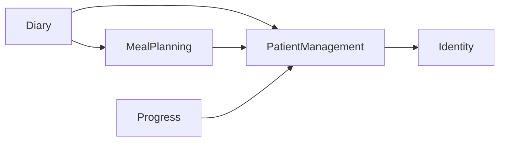

# Architecture
## Domain model
Modello concettuale recuperato; non è uno schema del database.

| Concetto | Attributi / responsabilità |
|---|---|
| User | id, email, name, role; identità comune |
| Patient / Nutritionist | profili; relazione di assegnazione |
| PatientNutritionistAssociation | patientId, nutritionistId, createdAt, status |
| MealPlan | id, patientId, createdBy, createdAt; identità stabile |
| MealPlanVersion | id, versionNumber, parentVersionId, validFrom, validUntil, createdAt, createdBy, changeSet; contenuto nutrizionale |
| Meal | id, type, time opzionale |
| MealOption | alternativa composta da FoodItem |
| FoodItem | food, quantity, unit; candidato Value Object |
| MealDiary | contenitore logico del diario del Patient |
| DiaryEntry | id, patientId, consumptionTime, createdAt, mealPlanVersionId opzionale, actualConsumption |
| DiarySharingPreference | patientId, enabled, updatedAt; policy globale |
| Measurement | id, patientId, type, value, unit, timestamp |
| ChangeSet | differenze tra versione parent e nuova versione |

syncStatus compare nel modello della fonte, ma la collocazione tecnica nei metadati di sincronizzazione è aperta (ADR-014).
Quantity, Food e DateRange sono candidati Value Object. Resolver temporale e versioning sono candidati Domain Services.
Cardinalità: Nutritionist → 0..* Patient; MealPlan → 1..* versioni; versione → 1..* pasti → 1..* opzioni → 1..* FoodItem; Patient → un diario → 0..* entry; entry → 0..1 versione; Patient → 0..* measurements. Obbligatorietà/esclusività dell'assegnazione e numero di MealPlan per Patient restano da verificare.

## Ownership
| Modulo | Dati posseduti |
|---|---|
| Identity & Access | identità, ruolo, informazioni autenticazione/sessione |
| Patient Management | profili e associazioni |
| Meal Planning | MealPlan, versioni, pasti, opzioni, FoodItem, ChangeSet |
| Meal Diary | diario, entry, preferenza privacy |
| Progress | measurements e tipi |

Un solo backend deployabile, modular monolith. UI e application layer orchestrano use case; domain contiene regole; infrastructure implementa persistenza locale/remota e sincronizzazione.
Ogni modulo mantiene repository e modelli persistenti privati. Il database fisico non determina il confine di ownership.

## Dipendenze consentite

Frecce: il chiamante usa il contratto pubblico del destinatario. Nessuna dipendenza inversa implicita. Identity non dipende dai domini nutrizionali.

## Module contracts
Operazioni concettuali, non firme implementative né specifica HTTP definitiva. Actor ID nei parametri non costituisce autenticazione: deve essere verificato contro il principal autenticato nell'application layer.

### Identity
- authenticate(credentials) → AuthenticatedUser { userId, role }
- getCurrentUser() → AuthenticatedUser
- logout()
Role = PATIENT | NUTRITIONIST. Token e provider non compaiono nel contratto.

### PatientManagement
- getPatient(patientId) → PatientProfile
- getNutritionist(nutritionistId) → NutritionistProfile
- getPatientsForNutritionist(nutritionistId) → PatientProfile[]
- isAssigned(nutritionistId, patientId) → boolean
Contratti di scrittura associazioni/profili ancora da definire.

### MealPlanning
- createMealPlan(nutritionistId, patientId, planContent) → MealPlanId
  Pre: Nutritionist assegnato. Post: piano e prima versione attiva.
- createNewVersion(nutritionistId, mealPlanId, baseVersionId, modifications) → MealPlanVersion
  Pre: assegnazione e baseVersion = currentVersion. Post: nuova versione, ChangeSet e transizione temporale coerente.
- getActiveVersion(patientId) → MealPlanVersion?
- getVersionAt(patientId, timestamp) → MealPlanVersion?
- getVersionHistory(mealPlanId) → MealPlanVersionSummary[]
Letture rispettano BR-01/02: Patient sui propri dati, Nutritionist su Patient associati. Struttura dettagliata DTO e flussi gestione da completare.

### Diary
- recordMeal(patientId, consumptionTime, actualConsumption) → DiaryEntry
  Pre: Patient opera sul proprio diario; input valido.
  Il sistema risolve versione con MealPlanning; il client non invia versionId.
- getOwnDiary(patientId, timeRange) → DiaryEntry[]
  Pre: principal.userId = patientId.
- getPatientDiary(nutritionistId, patientId, timeRange) → DiaryEntry[]
  Pre: ruolo corretto, assegnazione e sharingEnabled.
- enableDiarySharing(patientId), disableDiarySharing(patientId)
- isDiarySharingEnabled(patientId) → boolean
Modifica preferenza riservata al proprietario.

### Progress
- recordMeasurement(patientId, type, value, unit, timestamp) → Measurement
- getOwnMeasurements(patientId, timeRange) → Measurement[]
- getPatientMeasurements(nutritionistId, patientId, timeRange) → Measurement[]
Patient opera sui propri dati; Nutritionist legge solo pazienti assegnati. Tipi, unità e limiti di validazione da definire.

## Error contract
AuthenticationError; AuthorizationError con PatientNotAssigned e DiaryNotShared; ValidationError con InvalidMealPlan, InvalidMeasurement, InvalidDiaryEntry; NotFoundError con PatientNotFound, MealPlanNotFound; ConflictError con MealPlanVersionConflict.
La fonte usa anche il nome abbreviato VersionConflict: la documentazione adotta MealPlanVersionConflict. Codici di trasporto e payload sono aperti.
Nessun piano applicabile è un risultato opzionale di getVersionAt, non necessariamente un errore. Una lista autorizzata vuota è distinta dal diniego.

## API ed eventi
API interne sincrone per getVersionAt e isAssigned; eventi per fatti avvenuti.
Evento esemplificato: MealPlanVersionCreated { patientId, mealPlanId, newVersionId, validFrom }.
DiarySharingChanged e MeasurementRecorded sono candidati, non contratti completi. MealRecordedEvent è un esempio di possibile estensione.
Nessun broker imposto. Ordinamento, affidabilità e pubblicazione dopo commit da progettare. Eventi non sostituiscono controlli privacy correnti.

## Repository e offline
Esempio repository privato: DiaryRepository.save(entry), findByPatient(...), findById(...).
Domain/application dipendono dall'interfaccia; infrastruttura la implementa; test possono usare FakeDiaryRepository.
Sync engine trasversale: coda locale → tentativo → successo/conflitto. PENDING, SYNCING, SYNCED e CONFLICT sono stati illustrativi, non macchina a stati approvata.
La conferma remota deve preservare consumptionTime e applicare le stesse regole di dominio. Atomicità della sostituzione versione e controllo baseVersion non possono ridursi a un check seguito da una scrittura non protetta.

## Affinamenti ADR-020..022
Stack: React/Vite/TypeScript, Node/NestJS, PostgreSQL, IndexedDB; repository apps/web e apps/api.
Association: Patient ha 0..1 Nutritionist attivo, Nutritionist 0..* Patient. PatientManagement possiede invito e accettazione; contratti di comando da definire nel primo incremento progettuale.
DiarySharingPreference inizialmente false. UTC e intervalli [from,until). Sync operationId e stato pending sono metadati del trasporto, non scelta client della versione. Risoluzione locale non confermata distinta da riferimento nullo confermato. Pubblicazione versione e deduplicazione richiedono transazioni private del modulo proprietario.

## Chiusura decisioni per il primo incremento
ADR-023 confermata: prima measurement WEIGHT in kg; nuovi piani attivati immediatamente al server, senza retrodatazione/programmazione; modifica/cancellazione pasti e measurements rinviata; al cambio Nutritionist sharing disabilitato fino a nuova scelta del Patient.
ADR-024: email/password con sessione server, cookie HttpOnly e store persistente nel modulo Identity; Prisma negli adapter privati; Jest backend e Vitest frontend. Versioni/librerie concrete verificate al bootstrap. Il primo incremento con Codex può iniziare dai contratti, regole e repository fake.
